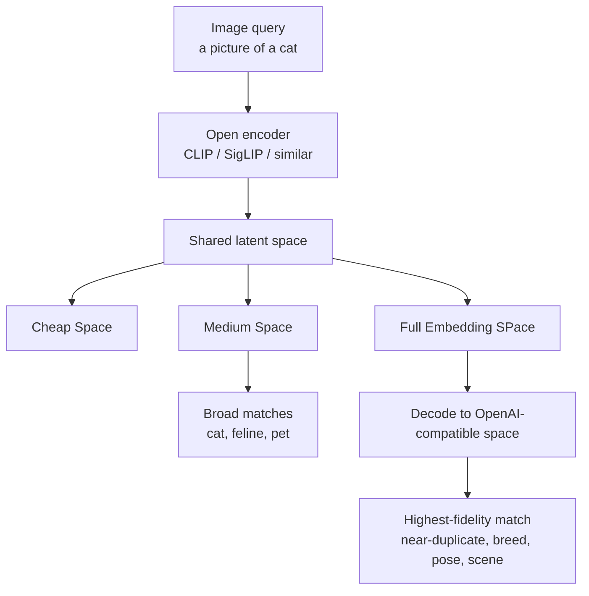

## Open Embeddings adds zero value if agents are trapped in their own "spaces"

Pre-Reading: 
 - [The Platonic Representation Hypothesis](https://arxiv.org/abs/2405.07987) 
 -  [Harnessing the Universal Geometry of Embeddings](https://arxiv.org/abs/2505.12540)
 - [Matryoshka Representation Learning](https://arxiv.org/abs/2205.13147)

## What to do about this

Others have already showed a GAN can be trained to generate a shared latent space between arbitrary embedding models. What has not been shown:
- Does the findings hold at scale with modern / proprietary models?
- What's the smallest possible transform between spaces that doesn't lose (that much) semantic shape / geometry? 
- Can we leverage Matryoshka Representations to further reduce the friction to move between worlds?

#### Yes, we can (probably)!
Albeit with some trusty AI helpers, due to staffing shortages (we're looking for unpaid interns), we think the answer is that we can publish adapters that allow textual content to be "cheaply" discovered. As an exercise to the community, we can let indivual transforms get revised by popularity / need.

<!-- truncate -->

### More Details - The goal is simple:

- small early layers for cheap CPU routing
- deeper layers for better matching
- one aligned layout instead of pairwise glue everywhere

So far, `bge-large + qwen3` works better than I expected.

Granite is still the problem as mappings start to collapse.

Adding it from the start hurt the strongest path. Delaying it helped, but not enough. Lowering alignment pressure did not fix it.

So the two-model latent looks real. The multi-model latent is not solved yet... work continues.

