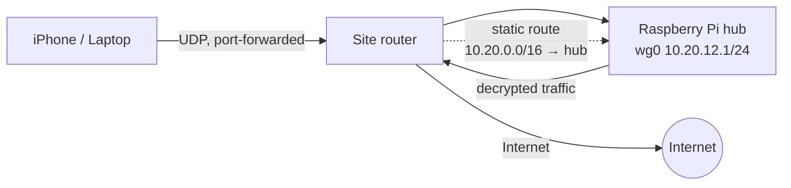

I'm still holding out against Tailscale. I've met the team (their CTO is a nice person), but the mission of 5L Labs is Privacy, not Conveniently Private. So we soldier on. The ask was small: give our research intern VPN access from an iPhone and a laptop to our three sites. Two evenings later, my AI assistant had forced me to understand things about WireGuard I'd been waaaay too lazy to learn. As in "wow, that's an interesting way to do it" is not the same as "the way the AI suggested to do it worked out of the box."

**The win 🎉:** WireGuard configs can finally live in source control. The private keys stay in Vault and get loaded at runtime, all with one line:

```ini
PostUp = wg set %i private-key /etc/wireguard/wg0.key
```

No secrets in the repo, a `.conf` that's safe to read, and nothing to scrub before a commit.


<!-- truncate -->

## The setup

Three Raspberry Pi hubs across three regions. Clients pick a hub. The Wisconsin hub had just been rebuilt after my first ever SD Card hard failure, so its config was gone.



Private keys live in a separate root-only file, so the main config is safe to read (and `chmod 644`):

```ini
[Interface]
Address = 10.20.12.1/24
ListenPort = <forwarded-port>
PostUp = wg set %i private-key /etc/wireguard/wg0.key
```

## WireGuard fails silently: a distracted person's risk

A broken WireGuard tunnel tells you nothing by design. It just drops packets. As we alluded to in [Trixie is Trixie](/self-hosted-iot/trixie-is-trixie), the agent is great at orchestrating test harnesses and collecting evidence. Having it make changes while listening with `tcpdump` on the hub saved a lot of head scratching, as did knowing the sizes of WireGuard's messages ([protocol](https://www.wireguard.com/protocol/)): **148 bytes** = handshake initiation, **92** = response, **32** = keepalive, data = inner packet padded to a multiple of 16, + 32.

```bash
sudo tcpdump -ni eth0 udp port <forwarded-port>   # outer, encrypted
sudo tcpdump -ni wg0                              # inner, decrypted
```

| What the agent / I saw | What it meant | Fix |
|---|---|---|
| Nothing on the listen port | Router forwards a *different* port than the config listens on (an old config had lied to me) | Probe from outside with `nc -u <ip> <port>` while capturing; match `ListenPort` to the forward |
| 148-byte packets in, nothing out | Handshake can't be decrypted: client has the **old hub public key** | Update the client's `[Peer] PublicKey` |
| Handshake OK, 96–128-byte packets in, **nothing on `wg0`** | Inner source IP isn't in that peer's `AllowedIPs`: the client's `Address` was wrong | Fix the client `Address` |
| Tunnel up, no DNS | Servers can't push DNS. No `DNS =` line, so iOS kept carrier (IPv6) DNS while `::/0` black-holed it | Set `DNS =` in the client; `AllowedIPs = 0.0.0.0/0` unless you route IPv6 |

The third one is the nastiest: the app says *connected*, the handshake is fresh, bytes are counted, and nothing works.

## No NAT, but mind the asymmetry

Internet traffic is symmetric (out via the router, back via the static route). LAN replies are not: a second DNS server on the LAN answered VPN clients via the router, whose stateful firewall had never seen the query and dropped it. The hub's own Pi-hole works; the other one needs a host route (or a router rule). Same class of problem as [Trixie is Trixie](/self-hosted-iot/trixie-is-trixie).

Also: a hub hostname resolving to last month's IP looks *exactly* like a dead hub. Check DNS before blaming WireGuard.

## The `&&` that left root behind

We had left droppings of the default Raspberry Pi user thanks to two Ansible bugs. The new user's account also had to be renamed on ~15 hosts, so I moved it into our [Ansible build](https://github.com/NickJLange/mkrasberry) ([PR #50](https://github.com/NickJLange/mkrasberry/pull/50)). Verifying the rename turned up `/home/pi` owned by the new user's uid, and on some hosts the image's default user still alive **with a password and passwordless sudo**. The culprit, in the stage that "removes" default users:

```yaml
shell: "if id {{ item }}; then killall -q -u {{ item }} -9 && userdel {{ item }}; fi"
ignore_errors: true
```

`killall` exits 1 when there's nothing to kill. On an idle box, which is every box, `userdel` never ran, and `ignore_errors` hid it. An older variant used `userdel -f` without `-r`, which deleted the user but left the home directory for the next account to inherit by uid. The fix ([PR #51](https://github.com/NickJLange/mkrasberry/pull/51)) is boring on purpose:

```yaml
- user: { name: "{{ item }}", state: absent, remove: true, force: true }
  loop: "{{ poison_usernames }}"
```

Plus deleting the image's leftover `NOPASSWD` sudoers file and making `%sudo` require a password.

## What-I-Learned

- **Silent systems need explicit probes.** My AI assistant plus `tcpdump` on both sides of the tunnel turns "doesn't work" into a specific cause in seconds.
- **`ignore_errors` is a smell.** Here it hid a root-level hole for who knows how long. But for home IoT, maybe it's not such a big deal.
- **Rebuilds/Renames are audits.** Moving one account surfaced the uid reuse, which surfaced the bug.
- AI did most of the legwork (captures, playbooks, a peer-review pass) - it really does save time spent manually typing things out.

*This post was cleaned up with Automation to clarify thoughts for the reader.*
